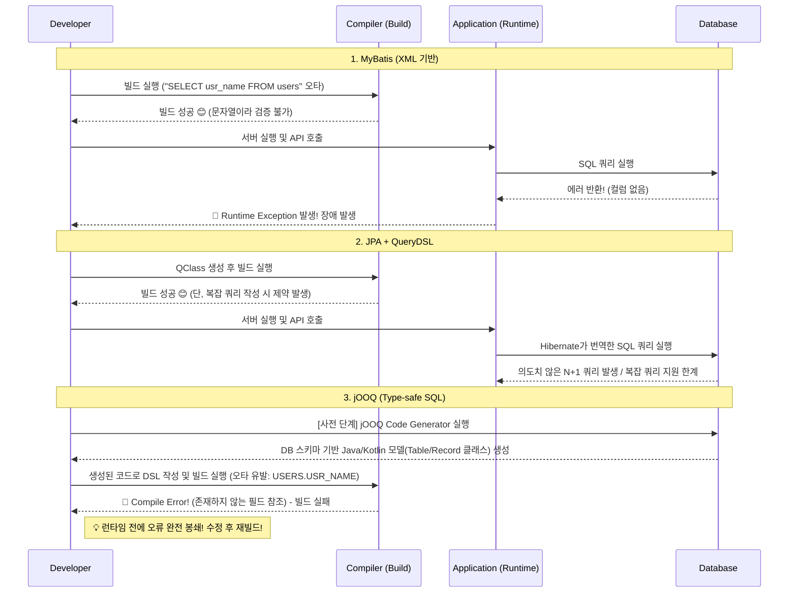

# Chapter 01: Why jOOQ? (JPA, MyBatis와의 비교 분석 및 Type-safety 철학)

안녕하세요! **Java & Kotlin 동시 정복: jOOQ 마스터 클래스**의 첫 번째 강의에 오신 것을 환영합니다.
이번 시간에는 현대 백엔드 생태계에서 데이터베이스를 다루는 대표적인 기술인 JPA, MyBatis, 그리고 우리가 배울 **jOOQ**를 비교 분석해보겠습니다. 더불어 jOOQ가 자랑하는 **'Type-safety(타입 안정성)'** 철학이 무엇인지 명확히 이해해 보겠습니다.

---

## 1. 데이터베이스 액세스 전략 비교

소프트웨어 개발에서 데이터베이스와 애플리케이션 계층 간의 통신은 필수적입니다. 자바/코틀린 진영에서는 이 역할을 크게 **MyBatis(SQL Mapper)**, **JPA/Hibernate(ORM)**가 양분해 왔습니다. 그렇다면 jOOQ는 왜 등장하게 되었을까요?

### 🌟 MyBatis: SQL Mapper
MyBatis는 개발자가 직접 작성한 SQL을 Java/Kotlin 객체와 매핑해주는 기술입니다.
* **장점:** 복잡한 SQL(동적 쿼리, 통계 쿼리)을 작성하기 자유롭고, DBA나 SQL에 친숙한 개발자에게 직관적입니다.
* **단점:** SQL을 **문자열(String) 또는 XML** 형태로 작성하므로, 오타가 발생해도 **컴파일 시점(빌드 단계)에 발견할 수 없습니다.** 애플리케이션을 실행하고 해당 쿼리가 호출되는 시점(런타임)에 가서야 에러가 발생합니다.

### 🌟 JPA (Hibernate): 객체 관계 매핑 (ORM)
JPA는 DB 테이블을 객체에 매핑하여, 패러다임의 불일치를 해결하고자 등장했습니다.
* **장점:** 단순한 CRUD에서 압도적인 생산성을 자랑하며, 객체 지향적인 비즈니스 로직 작성에 집중할 수 있습니다.
* **단점:** 통계 쿼리나 복잡한 조인을 처리하기 극도로 까다롭습니다. 결국 **QueryDSL** 같은 외부 DSL 기술에 강하게 의존하게 되며, N+1 쿼리 문제 등 성능 최적화를 위한 학습 곡선(Learning Curve)이 매우 높습니다.

### 🌟 jOOQ (Java Object Oriented Querying)
jOOQ는 **데이터베이스 중심(Database-first)**이라는 다른 철학을 가지고 있습니다.
DB 스키마를 읽어 메타데이터(클래스)를 생성한 뒤, 이를 활용해 Java/Kotlin 코드 상에서 형변환(Type-safe)이 보장된 SQL을 작성할 수 있게 해주는 엔진입니다.
* **장점:** SQL의 모든 기능을 코드(DSL)로 완벽하게 래핑합니다. 컴파일 시점에 SQL 문법이나 테이블명 구문 오류를 모두 잡아내며(Type-Safety), QueryDSL과 달리 다양한 DB의 고유 문법(예: Window 함수, JSONB 등)을 완벽 지원합니다.

---

## 2. 동작 흐름: 프레임워크별 실행 시점 차이 분석

개발자가 실수(예: 컬럼명 오타)를 했을 때 각각의 프레임워크가 오류를 인지하는 시점을 다이어그램으로 살펴보겠습니다.

### [BPMN] SQL 오류 발견 시점 비교 흐름도 



이 다이어그램이 보여주듯, 문자열 기반의 MyBatis는 런타임(운영) 단계에서 폭탄이 터집니다. 
반면 jOOQ는 **데이터베이스 스키마와 코드가 1:1로 동기화**되므로, 스키마에 없는 컬럼을 호출하거나 잘못된 타입을 넣으려 하면 즉시 **컴파일 타임 에러**를 뿜어냅니다. 
이것이 **jOOQ의 핵심 철학, Type-safety**입니다.

---

## 3. 코드 레벨 맛보기 (향후 개발 환경에서 시연할 내용 미리보기)

향후 `02.develop-code-skil`을 통해 구축할 샘플 프로젝트에서, 다음과 같은 비교 상황을 시연할 것입니다.

**상황: `users` 테이블에서 이메일로 유저 정보를 조회하는 경우** (의도적으로 쿼리에 오타 발생)

### 3.1 MyBatis 작성 예 (XML)

```xml
<select id="findByEmail" resultType="User">
    <!-- 오타: e_mail 컬럼은 존재하지 않음 -->
    SELECT id, e_mail 
    FROM users 
    WHERE email = #{email}
</select>
```
* **결과:** 애플리케이션은 정상적으로 올라갑니다. 하지만 회원이 로그인 버튼을 누르는 순간 런타임 SQL 문법 에러가 터지며 서버 모니터링에 알람이 울립니다.

### 3.2 jOOQ 작성 예 (Kotlin)

```kotlin
// jOOQ Code Generator에 의해 'USERS' 객체가 만들어져 있습니다.
fun findUserByEmail(email: String): UsersRecord? {
    return dslContext.selectFrom(USERS)
        // 오타: USERS.E_MAIL 로 접근 시도
        .where(USERS.E_MAIL.eq(email)) // 🚨 컴파일 에러: Unresolved reference: E_MAIL
        .fetchOne()
}
```
* **결과:** IDE에 즉시 빨간 줄이 표시됩니다. 컴파일 자체가 멈추기 때문에 **배포조차 불가능**합니다. 개발자는 런타임 테스트를 돌리기도 전에 100% 안전한 쿼리임을 확신할 수 있습니다.

---

## 4. 요약 및 다음 단계

오늘 우리는 다음과 같은 사실을 배웠습니다.
1. **MyBatis**는 SQL 자유도가 높으나 런타임 에러에 취약하다.
2. **JPA**는 단순 CRUD와 객체지향 설계에 유리하지만 복잡한 쿼리에 한계가 강하다.
3. **jOOQ**는 DSL을 통한 **Type-safe SQL 작성**으로 컴파일 시점에 모든 에러를 검증하며, 복잡한 통계 및 데이터베이스 고유의 함수들을 자유롭게 쓸 수 있다.

다음 강의에서는 이 놀라운 강력함을 실현하기 위해, **Docker를 활용한 데이터베이스 구축과 Gradle/jOOQ 플러그인 환경을 구성**하는 실습을 진행하겠습니다.

---
*(이 강의 스크립트에 제시된 코드는 향후 `develop-code-skill`을 바탕으로 Spring Boot 기본 코드베이스에서 직접 개발하고 테스트를 통해 검증할 예정입니다.)*
