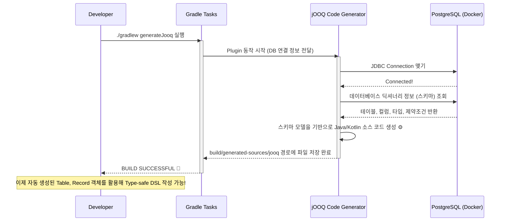

# Chapter 02: 환경 구축 (Docker 기반 DB 구성 및 jOOQ 플러그인 설정)

안녕하세요! **jOOQ 마스터 클래스** 두 번째 시간입니다.
이번 시간에는 jOOQ의 핵심 패러다임인 **'데이터베이스 중심 (Database-First)'** 개발을 시작하기 위해 로컬 환경을 세팅해 보겠습니다.

---

## 1. Code-First vs Database-First

들어가기에 앞서, 기술의 접근 방식을 짚고 넘어가겠습니다.

* **Code-First (JPA/Hibernate 스타일):**
  개발자가 Java/Kotlin 클래스(Entity)를 먼저 작성하고 실행하면, 프레임워크가 이를 분석해 데이터베이스 테이블(DDL)을 알아서 만들어 줍니다. (예: `spring.jpa.hibernate.ddl-auto=update`). 편하지만, 스키마 관리가 애플리케이션에 종속되어 DBA와의 협업이 어렵습니다.
* **Database-First (jOOQ 스타일):**
  데이터베이스 스키마(테이블, 뷰, 인덱스)가 진짜 **'단일 진실 공급원(Single Source of Truth)'**입니다. DB에 테이블이 존재하면, 도구(Generator)가 DB를 읽어 코드를 만들어 줍니다. 이를 통해 데이터베이스의 기능을 100% 활용할 수 있습니다.

따라서 jOOQ를 사용하려면 **반드시 내 로컬 PC에 접속 가능한 실제 DB가 떠 있어야** 합니다.

---

## 2. Docker Compose를 활용한 로컬 DB 세팅

로컬 PC에 데이터베이스를 직접 설치하는 것은 꽤 번거로운 일입니다. 우리는 `Docker Compose`를 활용하여 명령어 한 줄로 PostgreSQL 데이터베이스를 구동할 것입니다.

아래는 프로젝트 루트 경로에 위치할 `docker-compose.yml` 리소스 모델입니다.
```yaml
version: '3.8'
services:
  postgres:
    image: postgres:15
    container_name: jooq_postgres
    environment:
      POSTGRES_USER: postgres
      POSTGRES_PASSWORD: postgres
      POSTGRES_DB: jooq_demo
    ports:
      - "5432:5432"
```

터미널에서 `docker-compose up -d` 명령어만 치면 5초 안에 DB가 준비됩니다!

---

## 3. 코드의 탄생: jOOQ Code Generation Flow

DB가 준비되었으니, 이제 Gradle 빌드 스크립트에 **jOOQ Code Generator 플러그인**을 붙일 차례입니다.
이 플러그인은 DB의 메타데이터(컬럼명, 데이터 타입, 제약조건 등)를 통째로 읽어 Java/Kotlin 클래스로 변환해 줍니다. 바로 우리가 이전 챕터에서 그토록 칭찬했던 'Type-Safety'의 기반이 되는 코드입니다.

### [BPMN] jOOQ 코드 제너레이션 파이프라인



이 다이어그램처럼 빌드 스크립트의 `generateJooq` 태스크는 데이터베이스와 직접 통신합니다. 생성된 파일들은 `build` (또는 `target`) 폴더 하위에 떨어지므로 버전 관리(`git`) 대상에서 제외하는 것이 일반적인 관례입니다. DB를 고치고 제너레이터만 다시 돌리면 무한대로 자동 생성되기 때문이죠.

---

## 4. 요약 및 실습 준비

오늘 배운 내용을 정리하면 다음과 같습니다.
1. jOOQ는 DB가 먼저 존재해야 하는 **Database-first** 방식을 따른다.
2. 로컬 개발을 위해 **Docker Compose**로 PostgreSQL을 가볍게 띄운다.
3. **Gradle 플러그인(`nu.studer.jooq`)**이 DB 메타데이터를 빨아들여 마법처럼 Java/Kotlin 코드를 쏟아낸다.

이제 강의 이론은 끝났습니다. 다음 `develop-code-skill` 연계 실습을 통해 실제로 Docker를 띄우고, Gradle 설정을 만져 코드가 생성되는 짜릿한 순간을 경험해 보겠습니다!
