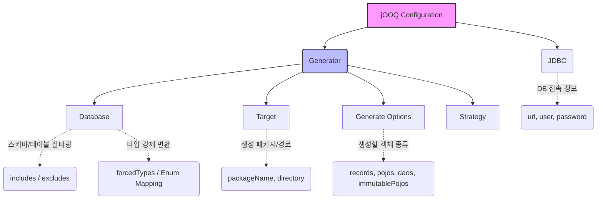

# Chapter 03: 코드 생성(Generation) - 자동화 전략과 커스터마이징

안녕하세요! **jOOQ 마스터 클래스** 세 번째 시간입니다.
지난 환경 구축 챕터에서 우리는 Gradle 플러그인(`nu.studer.jooq`)을 통해 DB 스키마로부터 Java/Kotlin 클래스가 생성되는 기적을 맛보았습니다.
하지만 실무에서는 "모든 테이블"을 "기본 설정"으로만 생성하지 않습니다. 이번 챕터에서는 생성기(Generator)를 우리 입맛에 맞게 조율하는 **커스터마이징(Customizing)** 전략에 대해 깊이 있게 다뤄보겠습니다.

---

## 1. jOOQ Generator 컴포넌트 이해하기

`build.gradle`에 작성하는 jOOQ 설정 블록은 크게 세 가지 핵심 컴포넌트로 나뉩니다.

### [BPMN] jOOQ 설정 XML/DSL 컴포넌트 구조

1. **Database (입력):** 어떤 스키마, 어떤 테이블을 읽을 것인지 정의합니다. 
   - `includes`: 정규식으로 생성할 객체를 지정합니다. (예: `.*`)
   - `excludes`: `flyway_schema_history`처럼 jOOQ가 몰라도 되는 마이그레이션 이력 테이블을 제외합니다.
2. **Generate Options (과정):** Table 객체 외에 묶음 데이터용 `Record`, DTO 대용으로 쓸 `POJO`, 아니면 `DAO` 클래스까지 만들어낼지를 결정하는 Boolean 스위치입니다.
3. **Target (출력):** 최종적으로 생성된 .java / .kt 파일들이 떨어질 패키지와 폴더 경로입니다.

---

## 2. 생성 객체의 종류 (Table vs Record vs POJO)

jOOQ가 만들어내는 주요 객체 트리오는 다음과 같은 역할을 합니다.

* **Table 객체 (예: `USERS`):**
  DSL에서 `selectFrom(USERS)` 처럼 테이블 뼈대와 컬럼 상수를 제공하는 메타모델입니다. (QClass 역할)
* **Record 객체 (예: `UsersRecord`):**
  단일 테이블의 '한 행(Row)'을 나타내며, **UpdatableRecord**를 상속받으면 객체 상태를 변경(`user.setName("New")`)한 뒤 `user.store()`로 바로 UPDATE를 칠 수 있는 Active Record 패턴을 지원합니다.
* **POJO 객체 (예: `com.example.jooq.tables.pojos.Users`):**
  DB 종속성이 전혀 없는 순수 Java/Kotlin 객체입니다. DTO로 변환하기 전 계층 간 데이터 전달용으로 쓰거나, Kotlin의 경우 `immutablePojos = true`를 켜서 불변(Immutable) 기반의 안정적인 개발을 할 수 있습니다.

---

## 3. 실무 팁: Forced Types (타입 강제 변환)

DB 설계 시 성능이나 레거시 사유로 상태 값을 `VARCHAR(1)`의 `Y`/`N` 으로 저장하는 경우가 흔합니다. 
하지만 Java/Kotlin 코드에서는 이를 `true`/`false`의 `Boolean`이나, 혹은 커스텀 `Enum`으로 다루고 싶을 텐데요.
jOOQ의 **ForcedType**을 설정하면 제너레이터가 생성할 때부터 해당 컬럼의 타입을 우리가 원하는 타입으로 매핑해 줍니다!

*(이후 진행할 스킬 연계 플랜에서, Java는 Enum 클래스와 Converter를 이용하고, Kotlin은 `forcedTypes`를 직접 설정하는 실습을 진행합니다.)*

---

## 4. 요약 및 다음 단계

오늘 배운 핵심 전략은 다음과 같습니다.
1. 불필요한 테이블(Ex. 마이그레이션 도구 테이블)은 **excludes** 정규식으로 빼서 빌드 속도와 파일 크기를 줄인다.
2. 필요한 객체 형태(`POJO`, 불변 객체 등)만 **generate** 플래그를 켜서 생성한다.
3. DB와 애플리케이션의 타입 불일치는 **ForcedTypes** 컨버터로 코드 생성 단계부터 미리 맞춰 놓는다.

다음 개발 실습 플랜에서는 이 이론들을 바탕으로 `build.gradle`을 고도화하여 내 마음대로 코드를 찍어내는 커스텀 팩토리를 구동해 보겠습니다.
