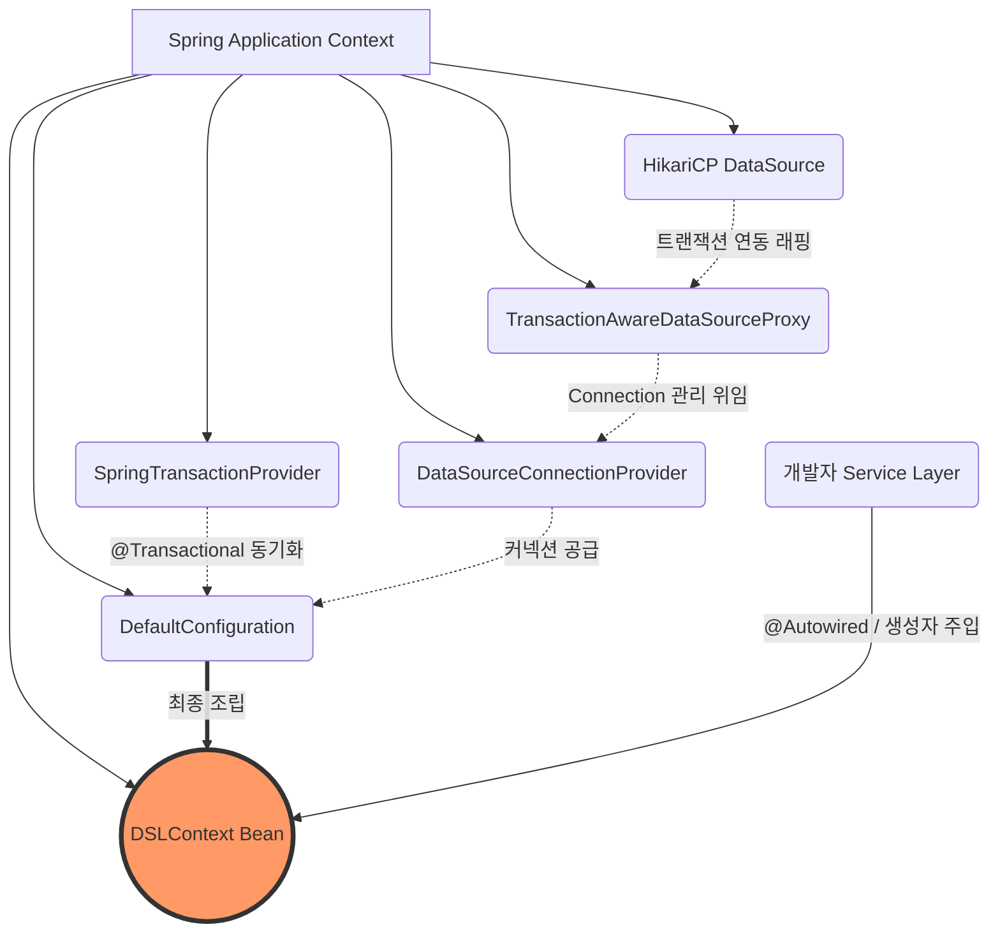

# Chapter 04: DSLContext 설정 (Spring Boot 연동 및 SQL Dialect 이해)

안녕하세요! **jOOQ 마스터 클래스** 네 번째 시간입니다.
우리는 지난 시간까지 DB 스키마로부터 Java/Kotlin 클래스를 뽑아내는(Code Generation) '빌드 환경' 구축을 마무리했습니다.
그렇다면 이제 애플리케이션을 띄워(Run) 실제로 쿼리를 날려볼 차례겠죠? 그 모든 쿼리의 시작점에는 언제나 **`DSLContext`** 가 있습니다.

---

## 1. DSLContext란 무엇인가?

`DSLContext`는 jOOQ의 심장이자 진입점입니다. **Domain Specific Language Context**의 약자로, 우리가 빌드한 Q-Class(스프링 환경의 경우 `Table` 객체)와 함께 조립되어 실제 SQL 쿼리로 변환하고 DB에 날려 결괏값을 가져오는 모든 행위를 주관합니다.

과거에는 이 `DSLContext`를 직접 다루기 위해 커넥션 풀을 할당하고, 트랜잭션 매니저를 엮어주는 등 초기 설정이 꽤나 까다로웠습니다. 하지만 현대의 **Spring Boot Auto-configuration** 환경에서는 이 모든 것이 완전 자동으로 해결됩니다!

---

## 2. Spring Boot 3.x 환경에서의 자동 설정(Auto-Configuration) 편의성

우리의 프로젝트 `build.gradle`에는 `spring-boot-starter-jooq` 의존성이 들어 있습니다.
이 스타터가 추가되면 Spring Boot는 기동할 때 다음 그림과 같은 구조로 `DSLContext` 빈(Bean)을 자동으로 생성하여 컨텍스트에 올려줍니다.

### [BPMN] Spring Boot - jOOQ DSLContext Auto-configuration 구조도



이 다이어그램이 뜻하는 바는 명확합니다. 
> *"개발자는 JDBC 커넥션을 어떻게 열고 닫을지, 트랜잭션을 어떻게 동기화할지 전혀 고민할 필요가 없다."*

개발자는 단지 사용할 Service/Repository 클래스의 생성자에 `DSLContext`만 주입해 달라고 선언하면 끝입니다. 참 쉽죠?

```java
// Java 예시
@Service
@RequiredArgsConstructor
public class UserService {
    private final DSLContext dsl; // 끝! 주입 완료.
    
    public void testQuery() {
        dsl.selectOne().fetch(); // 즉시 사용 가능
    }
}
```

---

## 3. SQL Dialect (방언)의 중요성

`DSLContext` 설정에서 절대 간과해선 안 되는 또 하나의 핵심이 바로 **SQL Dialect(방언)** 입니다.
jOOQ 코드 자체는 `select().from().limit(10)` 처럼 표준화된 한 가지 DSL만 사용합니다. 
하지만 이 코드가 PostgreSQL로 날아갈 때는 어떻게 번역될까요? MySQL일 때는요? Oracle일 때는 어떤가요?

jOOQ는 `DSLContext`에 설정된 `SQLDialect`를 보고 쿼리를 "해당 DB가 가장 좋아하는 문법"으로 런타임에 번역해 냅니다.

* **PostgreSQL / MySQL 환경 (LIMIT 지원):**
  * `dsl.select().from(USERS).limit(10)` 👉 `SELECT * FROM users LIMIT 10`
* **Oracle 11g 이전 환경 (ROWNUM 체계):**
  * 위와 똑같은 자바 코드가 👉 `SELECT * FROM (SELECT a.*, ROWNUM rn FROM users a) WHERE rn <= 10` 로 자동 번역되어 날아갑니다.

### 프로퍼티 설정 방법 (`application.yml`)
Spring Boot 환경에서는 너무나도 간단하게, 이 방언 속성 한 줄만 지정해주면 Auto-configuration이 알아서 `DSLContext`에 방언을 탑재해 줍니다.

```yaml
spring:
  jooq:
    sql-dialect: Postgres # (MySQL, Oracle, MariaDB 등 변경 기능)
```

---

## 4. 요약 및 다음 단계

오늘 우리는 다음과 같은 환상적인 사실을 알게 되었습니다.
1. `spring-boot-starter-jooq`만 있으면 **골치 아픈 세팅 없이 `DSLContext`를 주입받아 바로 쓸 수 있다.**
2. 스프링의 `@Transactional`과 완벽히 동기화되어, 안전하게 쿼리를 날릴 수 있다.
3. **SQL Dialect** 덕분에, DB를 오라클에서 Postgres로 마이그레이션 하더라도 **Java 코드는 단 한 줄도 고칠 필요가 없다.**

이듬해 이어질 실습 스킬에서는 기본 Java/Kotlin 코드 베이스를 복사한 뒤, 실제로 서비스 클래스에서 `DSLContext`를 주입받아 간단한 `Dual` / `Dummy` 쿼리를 날려보고, 나아가 Dialect를 고의로 바꾸어 보았을 때 생성되는 쿼리가 어떻게 변하는지 눈으로 확인해 보겠습니다!
