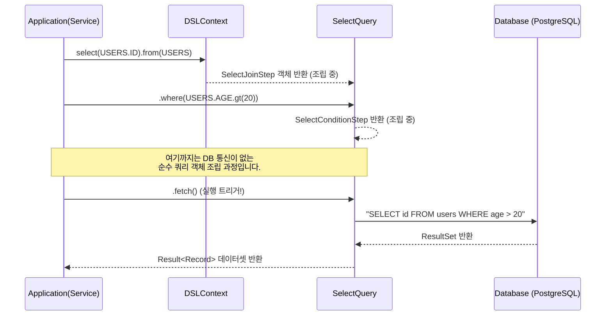

# Chapter 05: Select (기본 조회와 조건 제어)

안녕하세요! **jOOQ 마스터 클래스** 다섯 번째 시간입니다.
우리는 `DSLContext`를 스프링 빈으로 띄우는 것까지 성공했습니다! 이제 본격적으로 이 마법의 지팡이를 휘둘러 데이터베이스에서 데이터를 퍼올려보는 가장 짜릿한 순간, **Select** 편을 시작합니다.

---

## 1. jOOQ의 쿼리 실행 흐름 (Builder to Execution)

jOOQ 쿼리 작성의 가장 큰 특징은 **SQL을 작성하는 사고방식 그대로, Java/Kotlin 코드를 작성한다**는 점입니다. 하지만 중요한 법칙이 있습니다. `select().from().where()` 까지는 그저 **쿼리를 조립(Build)하는 중**일 뿐, DB로 쿼리가 날아가지 않습니다.

반드시 끝에 `.fetch()` 혹은 `.execute()` 류의 **실행(Execution) 메서드**를 호출해야 비로소 JDBC 커넥션을 타고 쿼리가 날아갑니다.

### [BPMN] jOOQ Statement Execution Lifecycle



---

## 2. 기본 조회의 기술 (Select & From)

### 2.1. 전체 데이터 가져오기 (`selectFrom`)
가장 단순하게 `SELECT * FROM users`를 치고 싶을 때, jOOQ는 우아한 축약형을 제공합니다.

```java
// Java / Kotlin 공통
var users = dsl.selectFrom(USERS).fetch();
```
`select().from()` 을 합친 `selectFrom()`은 코드를 더 간결하게 만들어 주며, 반환되는 타입도 `USERS` 테이블 규격에 딱 맞는 레코드 리스트를 돌려줍니다.

### 2.2. 특정 컬럼만 추출(Projection) 하기
비즈니스 로직 상 이름(Name)과 나이(Age)만 필요할 때가 많습니다. 이때 Type-Safety의 진가가 발휘됩니다.

```java
var specificData = dsl.select(USERS.NAME, USERS.AGE)
                      .from(USERS)
                      .fetch();
```
여기서 오타가 날 확률은 **0%** 입니다. 컬럼명은 모조리 상수로 자동 완성되기 때문입니다.

---

## 3. 조건식의 예술 (Where & Condition)

SQL의 가장 강력한 무기 중 하나인 `WHERE` 절을 jOOQ는 객체(`Condition`) 단위로 다룹니다.

| SQL 문법 | jOOQ 문법 | 설명 |
|---|---|---|
| `id = 1` | `USERS.ID.eq(1)` | Equals (일치) |
| `name IS NOT NULL` | `USERS.NAME.isNotNull()` | Null 체크 |
| `age > 20` | `USERS.AGE.gt(20)` | Greater Than (초과) |
| `status IN ('A', 'B')`| `USERS.STATUS.in("A", "B")` | 다중 포함 연산 |
| `title LIKE 'jOOQ%'` | `USERS.TITLE.like("jOOQ%")` | 패턴 매칭 |

### 3.1. AND와 OR로 조건 엮기
두 가지 이상의 조건을 부여할 때, 메서드 체이닝만으로 아름답게 엮어낼 수 있습니다.

```kotlin
// Kotlin 시연
val result = dsl.selectFrom(USERS)
                .where(USERS.AGE.ge(18)           // age >= 18
                    .and(USERS.STATUS.eq("ACTIVE")) // AND status = 'ACTIVE'
                )
                .fetch()
```

---

## 4. 별칭 (Alias)

가끔 동일한 테이블을 조인하거나 집계 함수를 쓸 때 별칭이 필요한데, `.as("별칭")` 메서드를 사용합니다. (조인 편에서 더 깊게 다룹니다.)

```java
// select name as "userName"
dsl.select(USERS.NAME.as("userName")).from(USERS)...
```

---

## 5. 요약 및 다음 단계

오늘 우리는:
1. 조립 단계(`select`, `where`)와 실행 단계(`fetch`)가 명확히 분리된 생명주기를 배웠습니다.
2. 컴파일러가 강력하게 검사해 주는 Type-Safe한 컬럼과 `Condition` 조건식 작성법을 마스터했습니다.

이제 다음 개발 실습 플랜에서는 **DB를 띄우고(Docker Start), 코드를 생성한 뒤**, Java와 Kotlin 기반의 스프링 컨텍스트 위에서 실제 `SELECT` 쿼리 단위 테스트를 시연해 보는 **Execution** 과정으로 넘어갑니다!
