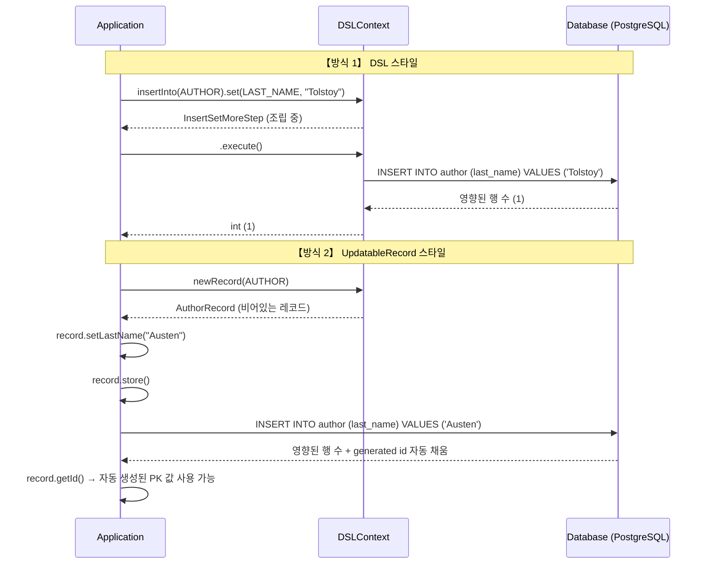
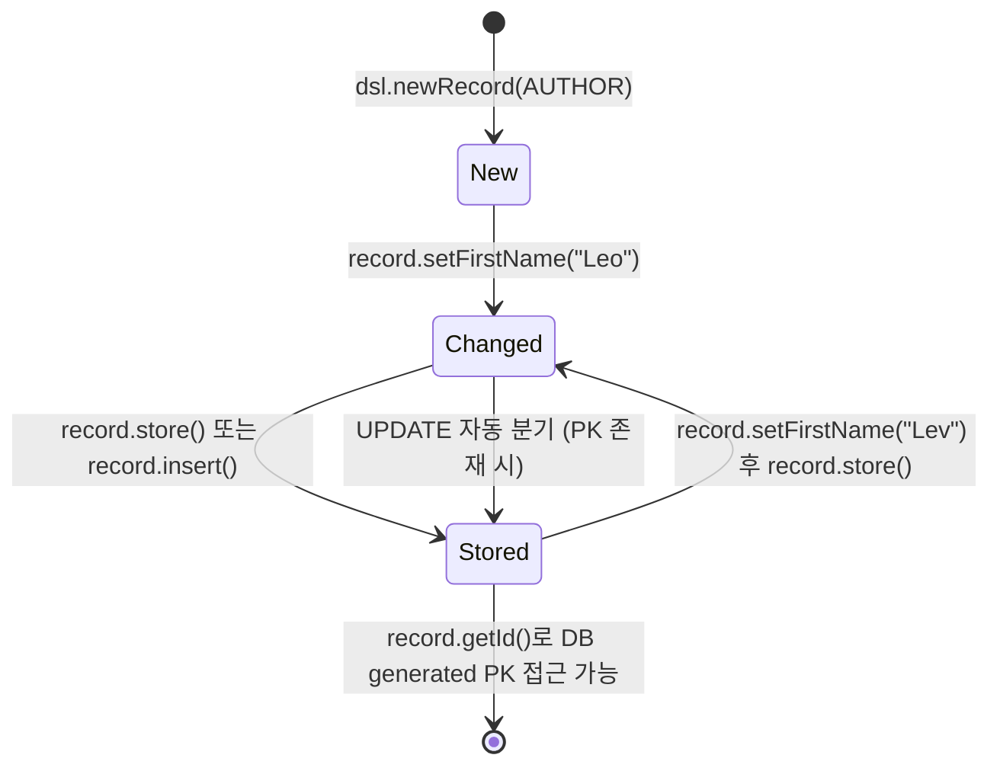

# Chapter 06: Insert (데이터 삽입의 두 가지 방식)

안녕하세요! **jOOQ 마스터 클래스** 여섯 번째 시간입니다.
지난 시간까지 우리는 DB에서 데이터를 *읽어오는* 방법을 완전 정복했습니다! 이제는 반대로 데이터를 *써넣는* 첫 번째 관문인 **INSERT** 편입니다. jOOQ의 INSERT는 놀랍도록 두 가지 얼굴을 가지고 있습니다. 각각의 철학과 사용 시나리오를 함께 파헤쳐 봅시다.

---

## 1. jOOQ INSERT의 두 가지 방식 비교

jOOQ는 데이터 삽입을 위한 두 가지 핵심 패턴을 제공합니다.

| 방식 | 핵심 API | 반환 타입 | 특징 |
|---|---|---|---|
| **DSL 스타일** | `insertInto().set().execute()` | `int` (영향 행 수) | SQL 문장을 그대로 코드로 표현, 세밀한 제어 가능 |
| **UpdatableRecord 스타일** | `newRecord().set().store()` | `int` (영향 행 수), 레코드 자체 갱신 | Active Record 패턴, DB generated 값 자동 채움 |

### [Mermaid] DSL INSERT vs UpdatableRecord INSERT 실행 흐름



---

## 2. DSL 스타일 INSERT

### 2.1. 기본 INSERT

가장 SQL에 가까운 방식입니다. `insertInto()`로 테이블을 지정하고, `columns().values()` 또는 `set()` 체인으로 데이터를 채웁니다.

```java
// Java: set() 체이닝 방식
int inserted = dsl.insertInto(AUTHOR)
                   .set(AUTHOR.FIRST_NAME, "Leo")
                   .set(AUTHOR.LAST_NAME, "Tolstoy")
                   .execute();
// inserted == 1 (성공 시)
```

```kotlin
// Kotlin: 동일한 구조
val inserted = dsl.insertInto(AUTHOR)
                  .set(AUTHOR.FIRST_NAME, "Leo")
                  .set(AUTHOR.LAST_NAME, "Tolstoy")
                  .execute()
```

### 2.2. INSERT ... RETURNING — 생성된 PK 즉시 회수

실무에서 가장 강력한 기능 중 하나입니다. `SERIAL` / `SEQUENCE` 로 자동 생성된 PK를 **별도 쿼리 없이** 한 번에 받아올 수 있습니다.

```java
// Java
Integer newId = dsl.insertInto(BOOK)
                    .set(BOOK.TITLE, "War and Peace")
                    .set(BOOK.AUTHOR_ID, 3)
                    .set(BOOK.PUBLISHED_YEAR, 1869)
                    .returning(BOOK.ID)
                    .fetchOne()
                    .getId();
```

```kotlin
// Kotlin
val newId: Int? = dsl.insertInto(BOOK)
                      .set(BOOK.TITLE, "War and Peace")
                      .set(BOOK.AUTHOR_ID, 3)
                      .set(BOOK.PUBLISHED_YEAR, 1869)
                      .returning(BOOK.ID)
                      .fetchOne()
                      ?.id
```

> **PostgreSQL의 `RETURNING` 절과 완벽 매핑됩니다.**
> 내부적으로 `INSERT INTO book (...) VALUES (...) RETURNING id` 쿼리가 발행됩니다.

---

## 3. UpdatableRecord 스타일 INSERT

### 3.1. Active Record 패턴

`UpdatableRecord`는 테이블 Row 하나를 Java/Kotlin 객체로 표현한 개념입니다. DB와 상태를 *공유*하는 살아있는 객체라 생각하면 됩니다.



```java
// Java: UpdatableRecord 방식
AuthorRecord record = dsl.newRecord(AUTHOR);
record.setFirstName("Leo");
record.setLastName("Tolstoy");
record.store(); // INSERT 실행

// store() 완료 후 DB generated 값이 채워짐
Integer generatedId = record.getId();
```

```kotlin
// Kotlin
val record = dsl.newRecord(AUTHOR).apply {
    firstName = "Leo"
    lastName  = "Tolstoy"
}
record.store()

val generatedId = record.id
```

> **`store()` vs `insert()` 차이:**
> - `store()`: PK가 없으면 INSERT, 있으면 UPDATE. 스마트 저장.
> - `insert()`: 항상 INSERT. 의도를 명시적으로 표현.

### 3.2. 두 방식 중 언제 무엇을 선택할까?

| 상황 | 권장 방식 |
|---|---|
| 단순 일괄 데이터 삽입, 복잡한 SET 로직 | DSL 스타일 |
| 삽입 후 generated PK가 즉시 필요 | `RETURNING` 절 또는 `UpdatableRecord` |
| 삽입/수정을 통합 처리 (upsert-like) | UpdatableRecord (`store()`) |
| 여러 테이블을 걸친 복잡한 INSERT | DSL 스타일 |

---

## 4. 요약 및 다음 단계

오늘 우리는:
1. **DSL 스타일**로 SQL의 INSERT 문을 그대로 코드로 표현하는 방법을 배웠습니다.
2. **UpdatableRecord**로 Row 객체를 직접 다루며 generated 값을 자동으로 받아오는 패턴을 익혔습니다.
3. **`INSERT ... RETURNING`** 으로 별도 SELECT 없이 생성된 PK를 한 번에 회수하는 PostgreSQL의 강력한 기능을 jOOQ로 우아하게 활용했습니다.

다음 개발 실습 플랜에서는 Docker DB를 구동하고, Java와 Kotlin 양쪽에서 `@Transactional` + `@SpringBootTest` 환경으로 모든 INSERT 패턴을 테스트 코드로 검증해 보겠습니다!
