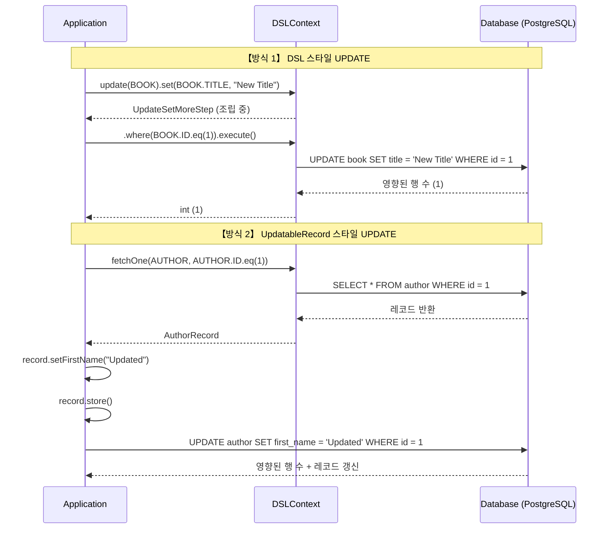
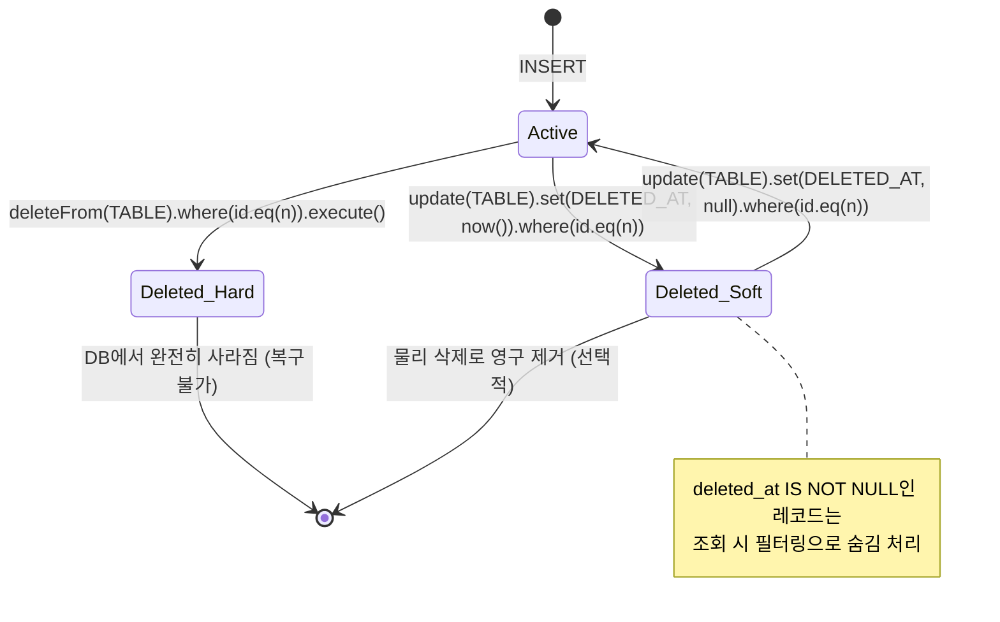

# Chapter 07: Update & Delete (조건부 수정과 물리/논리 삭제)

안녕하세요! **jOOQ 마스터 클래스** 일곱 번째 시간입니다.
지난 시간(INSERT)에 데이터를 *쓰는* 법을 익혔습니다. 이제는 데이터를 *수정(UPDATE)* 하고 *삭제(DELETE)* 하는 법을 마스터할 차례입니다. 특히 실무에서 절대 빠질 수 없는 **논리 삭제(Soft Delete)** 패턴까지 함께 정복하겠습니다!

---

## 1. jOOQ UPDATE의 두 가지 얼굴

### [Mermaid] DSL UPDATE vs UpdatableRecord UPDATE 실행 흐름



---

## 2. DSL 스타일 UPDATE

SQL의 UPDATE 문을 완전히 코드로 표현합니다. `WHERE` 조건을 반드시 명시하는 것이 안전합니다.

```java
// Java: 책 제목 수정
int updated = dsl.update(BOOK)
                  .set(BOOK.TITLE, "War and Peace (Revised)")
                  .where(BOOK.ID.eq(bookId))
                  .execute();
// updated == 1 (성공 시)
```

```kotlin
// Kotlin: 동일한 구조
val updated = dsl.update(BOOK)
                 .set(BOOK.TITLE, "War and Peace (Revised)")
                 .where(BOOK.ID.eq(bookId))
                 .execute()
```

| SQL 수정 패턴 | jOOQ 메서드 |
|---|---|
| `SET col = value` | `.set(FIELD, value)` |
| `SET col = col + 1` | `.set(FIELD, FIELD.add(1))` |
| `WHERE id = ?` | `.where(TABLE.ID.eq(id))` |
| `WHERE id IN (...)` | `.where(TABLE.ID.in(ids))` |

---

## 3. UpdatableRecord 스타일 UPDATE

레코드를 먼저 조회한 뒤 변경하고 `store()` 를 호출합니다. PK가 있는 레코드는 자동으로 UPDATE를 수행합니다.

```java
// Java: 작가 이름 수정 (UpdatableRecord)
AuthorRecord record = dsl.fetchOne(AUTHOR, AUTHOR.ID.eq(authorId));
if (record != null) {
    record.setFirstName("Lev");
    record.store(); // PK 존재 → 자동으로 UPDATE
}
```

```kotlin
// Kotlin: let {} 활용
dsl.fetchOne(AUTHOR, AUTHOR.ID.eq(authorId))?.let {
    it.firstName = "Lev"
    it.store()
}
```

---

## 4. DELETE — 물리 삭제 vs 논리 삭제

실무에서 데이터를 '삭제'하는 방법은 두 가지가 있습니다. 어떤 방식을 선택하느냐는 비즈니스 요구사항에 달려있습니다.



### 4.1. Hard Delete (물리 삭제)

```java
// Java: 완전 삭제
int deleted = dsl.deleteFrom(BOOK)
                  .where(BOOK.ID.eq(bookId))
                  .execute();
```

> ⚠️ **주의:** `where()` 조건 없이 `deleteFrom(TABLE).execute()` 를 실행하면 **테이블 전체가 삭제**됩니다!

### 4.2. Soft Delete (논리 삭제)

`book` 테이블에 `deleted_at TIMESTAMP` 컬럼을 추가하고, 삭제 시 현재 시각으로 UPDATE합니다.

```java
// Java: 논리 삭제
int softDeleted = dsl.update(BOOK)
                      .set(BOOK.DELETED_AT, LocalDateTime.now())
                      .where(BOOK.ID.eq(bookId))
                      .where(BOOK.DELETED_AT.isNull()) // 이미 삭제된 것 방지
                      .execute();
```

```kotlin
// Kotlin: 논리 삭제 후 활성 목록 조회
fun findActiveBooks() = dsl.selectFrom(BOOK)
    .where(BOOK.DELETED_AT.isNull())
    .fetch()
```

| 방식 | 장점 | 단점 |
|---|---|---|
| Hard Delete | 스토리지 절약, 쿼리 단순 | 복구 불가, 감사 추적 불가 |
| Soft Delete | 복구 가능, 삭제 이력 보존 | 모든 조회에 `IS NULL` 조건 추가 필요, 인덱스 주의 |

---

## 5. 요약 및 다음 단계

오늘 우리는:
1. **DSL UPDATE**로 SQL 문을 그대로 코드로 표현하는 방법을 배웠습니다.
2. **UpdatableRecord**를 이용해 조회 후 수정-저장하는 Active Record 패턴을 익혔습니다.
3. **Hard Delete vs Soft Delete**의 차이와 각각의 구현법을 마스터했습니다.

다음 개발 실습 플랜에서는 `deleted_at` 컬럼이 추가된 스키마 위에서 네 가지 패턴을 모두 테스트 코드로 검증해 보겠습니다!
