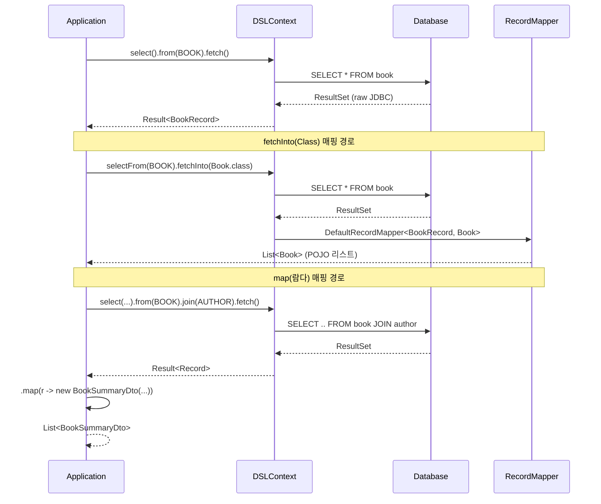
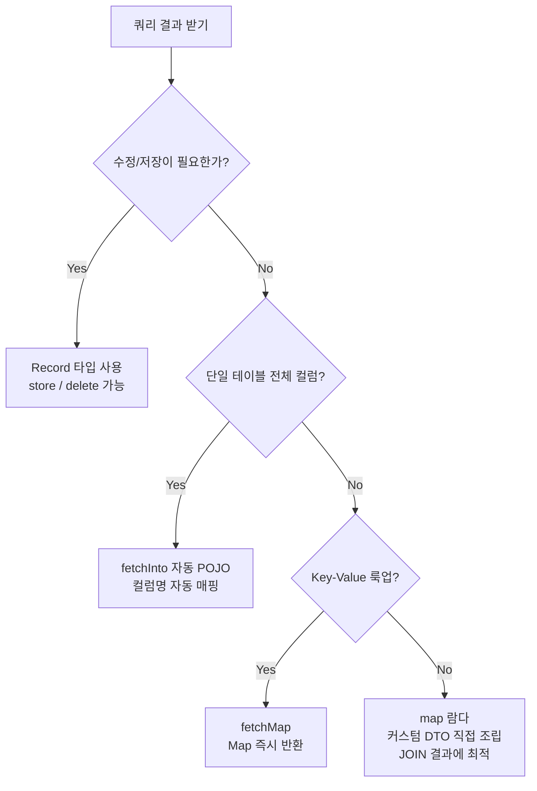

# Chapter 08: Record와 POJO (결과 매핑의 네 가지 전략)

안녕하세요! **jOOQ 마스터 클래스** 여덟 번째 시간입니다.
SELECT → UPDATE → DELETE 까지 CUD를 정복했습니다! 이번 시간에는 조금 다른 관점에서, 쿼리 결과를 **어떻게 받아 쓸 것인가**에 집중합니다. jOOQ의 결과 매핑(Result Mapping)은 생각보다 훨씬 강력하고 다양합니다.

---

## 1. Record vs POJO — 무엇이 다른가?

jOOQ 코드 생성기는 두 종류의 Java/Kotlin 클래스를 만들어 냅니다.

| 구분 | 클래스 예시 | 특징 |
|---|---|---|
| **Record** | `AuthorRecord`, `BookRecord` | `UpdatableRecord` 상속. DB와 연결되어 `store()`, `delete()` 가능. 모든 컬럼 포함 |
| **POJO** | `Author`, `Book` | 단순 데이터 객체(DTO). DB 연결 없음. `equals/hashCode/toString` 자동 생성 |

> **언제 무엇을 쓸까?**
> - 데이터를 가져온 후 수정/저장이 필요하면 → **Record**
> - 읽기 전용으로 서비스 레이어나 API 응답에 활용할 때 → **POJO / 커스텀 DTO**

---

## 2. fetchInto 데이터 변환 파이프라인



---

## 3. 네 가지 매핑 전략 상세

### 3.1. Record 타입 – jOOQ의 기본

가장 jOOQ다운 방식입니다. 결과를 타입 안전하게 다룰 수 있고, 필요시 즉시 수정/저장이 가능합니다.

```java
// Java
List<BookRecord> records = dsl.selectFrom(BOOK).fetch();
records.forEach(r -> System.out.println(r.getTitle() + " / " + r.getPublishedYear()));
```

```kotlin
// Kotlin
val records = dsl.selectFrom(BOOK).fetch()
records.forEach { println("${it.title} / ${it.publishedYear}") }
```

### 3.2. POJO 매핑 – `fetchInto(Class)`

자동 생성된 POJO(`Book`, `Author`)나 커스텀 DTO로 변환합니다. 컬럼명과 필드명이 camelCase로 자동 매핑됩니다.

```java
// Java: 자동 생성 POJO로 변환
List<Book> books = dsl.selectFrom(BOOK)
                       .fetchInto(Book.class);
```

```kotlin
// Kotlin
val books: List<Book> = dsl.selectFrom(BOOK).fetchInto(Book::class.java)
```

### 3.3. Map 변환 – `fetchMap(keyField, valueField)`

ID → 이름 같은 Key-Value 룩업 테이블이 필요할 때 한 줄로 해결합니다.

```java
// Java: Map<BookId, BookTitle>
Map<Integer, String> bookMap = dsl
    .select(BOOK.ID, BOOK.TITLE)
    .from(BOOK)
    .fetchMap(BOOK.ID, BOOK.TITLE);

String title = bookMap.get(1); // "Hamlet"
```

```kotlin
// Kotlin
val bookMap: Map<Int?, String?> = dsl
    .select(BOOK.ID, BOOK.TITLE)
    .from(BOOK)
    .fetchMap(BOOK.ID, BOOK.TITLE)
```

### 3.4. 커스텀 DTO 매핑 – `map(람다)`

JOIN 결과처럼 여러 테이블을 엮은 복잡한 데이터를 원하는 DTO로 직접 조립합니다.

```java
// Java: BookSummaryDto record
record BookSummaryDto(Integer id, String title, String authorLastName) {}

List<BookSummaryDto> summaries = dsl
    .select(BOOK.ID, BOOK.TITLE, AUTHOR.LAST_NAME)
    .from(BOOK)
    .join(AUTHOR).on(BOOK.AUTHOR_ID.eq(AUTHOR.ID))
    .fetch(r -> new BookSummaryDto(
        r.get(BOOK.ID),
        r.get(BOOK.TITLE),
        r.get(AUTHOR.LAST_NAME)
    ));
```

```kotlin
// Kotlin: data class
data class BookSummaryDto(val id: Int?, val title: String?, val authorLastName: String?)

val summaries = dsl
    .select(BOOK.ID, BOOK.TITLE, AUTHOR.LAST_NAME)
    .from(BOOK)
    .join(AUTHOR).on(BOOK.AUTHOR_ID.eq(AUTHOR.ID))
    .fetch { BookSummaryDto(it[BOOK.ID], it[BOOK.TITLE], it[AUTHOR.LAST_NAME]) }
```

---

## 4. 전략 선택 가이드



---

## 5. 요약 및 다음 단계

오늘 우리는:
1. **Record vs POJO**의 차이와 각각의 적합한 사용 시나리오를 배웠습니다.
2. **`fetchInto`** 로 자동 매핑된 POJO 리스트를 간편하게 얻는 법을 익혔습니다.
3. **`fetchMap`** 으로 ID→값 룩업 Map을 한 줄로 생성하는 패턴을 마스터했습니다.
4. **람다 `map`** 으로 JOIN 결과를 원하는 커스텀 DTO로 조립하는 유연한 방식을 배웠습니다.

다음 개발 실습에서 네 가지 전략을 모두 테스트 코드로 검증합니다!
