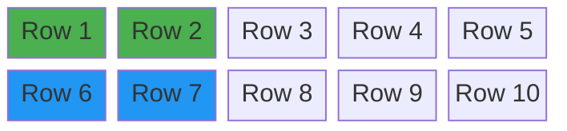
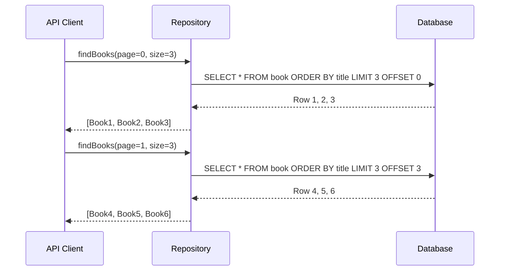

# Chapter 09: 정렬과 페이징 (orderBy, limit, offset 완전 정복)

안녕하세요! **jOOQ 마스터 클래스** 아홉 번째 시간입니다.
지금까지 데이터를 읽고, 쓰고, 수정하고, 삭제하고, 변환까지 했습니다. 이번 시간에는 실무 API의 핵심인 **정렬과 페이징**을 정복합니다. `ORDER BY`, `LIMIT`, `OFFSET` — SQL에서 가장 자주 쓰이는 조합을 jOOQ로 완벽하게 표현해 봅시다!

---

## 1. 정렬(ORDER BY) — ASC와 DESC

jOOQ에서 정렬은 컬럼 객체에 `.asc()` 또는 `.desc()`를 붙이는 것만으로 끝납니다.

```java
// Java: 제목 오름차순
dsl.selectFrom(BOOK)
   .orderBy(BOOK.TITLE.asc())
   .fetch();

// 출판연도 내림차순 (최신순)
dsl.selectFrom(BOOK)
   .orderBy(BOOK.PUBLISHED_YEAR.desc())
   .fetch();
```

```kotlin
// Kotlin: 동일
dsl.selectFrom(BOOK)
    .orderBy(BOOK.TITLE.asc())
    .fetch()
```

### 다중 컬럼 정렬

1차 정렬키가 같을 때 2차 정렬키로 이어집니다.

```java
// Java: 출판연도 내림차순, 같은 연도이면 제목 오름차순
dsl.selectFrom(BOOK)
   .orderBy(
       BOOK.PUBLISHED_YEAR.desc(),
       BOOK.TITLE.asc()
   )
   .fetch();
```

---

## 2. 페이징(Paging) — LIMIT과 OFFSET

### 2.1. 페이징 개념





### 2.2. jOOQ 코드

```java
// Java: 0-based 페이지 번호
int page = 0; // 1페이지 (0부터 시작)
int size = 3; // 페이지당 3건

List<Book> result = dsl.selectFrom(BOOK)
    .orderBy(BOOK.TITLE.asc())
    .limit(size)
    .offset((long) page * size)
    .fetchInto(Book.class);
```

```kotlin
// Kotlin: 동일
fun findBooksWithPaging(page: Int, size: Int): List<Book> =
    dsl.selectFrom(BOOK)
        .orderBy(BOOK.TITLE.asc())
        .limit(size)
        .offset(page.toLong() * size)
        .fetchInto(Book::class.java)
```

---

## 3. 실전 패턴 — 정렬 + 페이징 복합 적용

실무에서 가장 많이 쓰이는 **정렬된 페이지 목록** 패턴입니다.

```java
// Java: 최신 책부터, 같은 연도면 제목순, 페이징 적용
public List<Book> findBooksWithMultiSort(int page, int size) {
    return dsl.selectFrom(BOOK)
              .orderBy(
                  BOOK.PUBLISHED_YEAR.desc(),
                  BOOK.TITLE.asc()
              )
              .limit(size)
              .offset((long) page * size)
              .fetchInto(Book.class);
}
```

---

## 4. 정렬 방향 비교

| SQL | jOOQ |
|---|---|
| `ORDER BY title ASC` | `.orderBy(BOOK.TITLE.asc())` |
| `ORDER BY year DESC` | `.orderBy(BOOK.PUBLISHED_YEAR.desc())` |
| `ORDER BY year DESC, title ASC` | `.orderBy(BOOK.PUBLISHED_YEAR.desc(), BOOK.TITLE.asc())` |
| `LIMIT 10 OFFSET 20` | `.limit(10).offset(20)` |

> ⚠️ **주의:** `OFFSET` 기반 페이징은 데이터가 많아질수록 성능이 저하됩니다. 대용량 데이터에서는 Keyset(Cursor) 페이징을 고려하세요 — 이는 jOOQ 중/고급 과정에서 다룹니다.

---

## 5. 요약 및 다음 단계

오늘 우리는:
1. **`orderBy(FIELD.asc()/desc())`** 로 단일/다중 컬럼 정렬을 Type-Safe하게 표현했습니다.
2. **`limit(size).offset(page * size)`** 로 표준 Offset 페이징 쿼리를 구현했습니다.
3. **정렬 + 페이징 복합 패턴**으로 실무에 바로 쓸 수 있는 API용 쿼리를 완성했습니다.

다음 Chapter 10에서는 Java와 Kotlin으로 각각 구현하는 회원 정보 CRUD 관리자 페이지 **기초 프로젝트**로 Phase 1을 마무리합니다!
