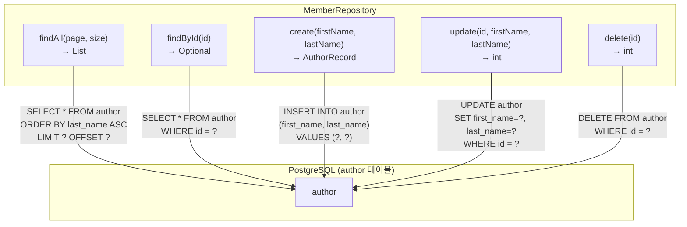

# Chapter 10: 기초 프로젝트 (회원 CRUD 관리자 구현)

안녕하세요! **jOOQ 마스터 클래스** 열 번째이자 Phase 1 마지막 시간입니다! 🎉
05강부터 09강까지 배운 SELECT, INSERT, UPDATE, DELETE, 정렬, 페이징을 **하나의 실전 Repository**로 통합해 봅니다. 지금까지 배운 모든 것을 한 번에 복습하고 완성하는 시간입니다!

---

## 1. 프로젝트 개요



---

## 2. 각 메서드 상세 구현

### 2.1. findAll — 목록 조회 (정렬 + 페이징)

```java
// Java
public List<Author> findAll(int page, int size) {
    return dsl.selectFrom(AUTHOR)
              .orderBy(AUTHOR.LAST_NAME.asc())
              .limit(size)
              .offset((long) page * size)
              .fetchInto(Author.class);
}
```

```kotlin
// Kotlin
fun findAll(page: Int, size: Int): List<Author> =
    dsl.selectFrom(AUTHOR)
        .orderBy(AUTHOR.LAST_NAME.asc())
        .limit(size)
        .offset(page.toLong() * size)
        .fetchInto(Author::class.java)
```

### 2.2. findById — 단건 조회

```java
// Java: Optional로 null-safe 처리
public Optional<Author> findById(int id) {
    return Optional.ofNullable(
        dsl.selectFrom(AUTHOR)
           .where(AUTHOR.ID.eq(id))
           .fetchOneInto(Author.class)
    );
}
```

```kotlin
// Kotlin: nullable 반환
fun findById(id: Int): Author? =
    dsl.selectFrom(AUTHOR)
        .where(AUTHOR.ID.eq(id))
        .fetchOneInto(Author::class.java)
```

### 2.3. create — 회원 등록

```java
// Java: UpdatableRecord 방식 - DB 자동 생성 ID 수신
public AuthorRecord create(String firstName, String lastName) {
    AuthorRecord record = dsl.newRecord(AUTHOR);
    record.setFirstName(firstName);
    record.setLastName(lastName);
    record.store();
    return record;
}
```

### 2.4. update — 회원 수정

```java
// Java: DSL UPDATE
public int update(int id, String firstName, String lastName) {
    return dsl.update(AUTHOR)
              .set(AUTHOR.FIRST_NAME, firstName)
              .set(AUTHOR.LAST_NAME, lastName)
              .where(AUTHOR.ID.eq(id))
              .execute();
}
```

### 2.5. delete — 회원 삭제

```java
// Java: Hard Delete
public int delete(int id) {
    return dsl.deleteFrom(AUTHOR)
              .where(AUTHOR.ID.eq(id))
              .execute();
}
```

---

## 3. Phase 1 복습 매핑표

| 메서드 | 08강 활용 기법 | 핵심 API |
|--------|-------------|---------|
| `findAll` | 09강 정렬+페이징 | `orderBy().limit().offset()` |
| `findById` | 05강 SELECT + WHERE | `where().fetchOneInto()` |
| `create` | 06강 INSERT | `newRecord().store()` |
| `update` | 07강 UPDATE | `update().set().where()` |
| `delete` | 07강 DELETE | `deleteFrom().where()` |

---

## 4. 요약

오늘로 **Phase 1 (기초 과정 10강)**이 완성되었습니다! 🎊

jOOQ의 핵심 철학인 **Type-Safe SQL**로 다음을 마스터했습니다:
- ✅ 환경 구축부터 코드 생성까지
- ✅ SELECT / INSERT / UPDATE / DELETE 완전 정복
- ✅ Record, POJO, Map, 커스텀 DTO 매핑
- ✅ 정렬과 페이징
- ✅ **이번 시간: 모든 기법의 통합 적용**

다음 **Phase 2 (중·고급 과정)**에서는 동적 SQL, JOIN, 서브쿼리, 윈도우 함수 등 더욱 강력한 기능들을 탐험합니다!
