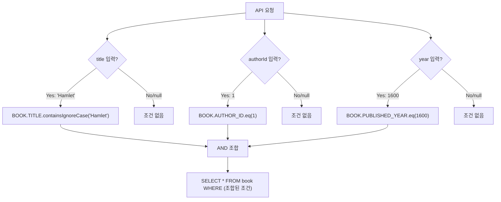

# Chapter 11: 동적 SQL의 마법 (Condition 조립 & noCondition)

안녕하세요! **jOOQ 마스터 클래스** Phase 2 첫 번째 시간입니다! 🚀
이제부터는 실무에서 정말 자주 마주치는 복잡한 요구사항들을 해결합니다. 첫 번째 주제는 **동적 SQL** — 사용자가 입력한 조건만 WHERE 절에 반영하는 마법같은 기법입니다!

---

## 1. 왜 동적 SQL이 필요한가?

실무 검색 API를 생각해 보세요:

```
GET /books?title=Hamlet&authorId=&year=
```

이 경우 `title`만 입력되었고 나머지는 비어 있습니다. 우리는 이렇게 동작해야 합니다:



---

## 2. Java - Condition 리스트 조립 패턴

```java
public List<Book> searchBooks(String title, Integer authorId, Integer year) {
    List<Condition> conditions = new ArrayList<>();

    if (title != null && !title.isBlank()) {
        conditions.add(BOOK.TITLE.containsIgnoreCase(title)); // ILIKE '%title%'
    }
    if (authorId != null) {
        conditions.add(BOOK.AUTHOR_ID.eq(authorId));
    }
    if (year != null) {
        conditions.add(BOOK.PUBLISHED_YEAR.eq(year));
    }

    return dsl.selectFrom(BOOK)
              .where(DSL.and(conditions))   // 빈 리스트이면 WHERE TRUE (전체 조회)
              .orderBy(BOOK.TITLE.asc())
              .fetchInto(Book.class);
}
```

> **핵심:** `DSL.and(emptyList())` 는 `TRUE`가 되어 전체 조회와 동일합니다.

---

## 3. Java - `DSL.noCondition()` 체이닝 패턴

```java
public List<Book> searchBooksWithNoCondition(String title, Integer year) {
    Condition condition = DSL.noCondition(); // 시작점: 항상 TRUE

    if (title != null && !title.isBlank()) {
        condition = condition.and(BOOK.TITLE.containsIgnoreCase(title));
    }
    if (year != null) {
        condition = condition.and(BOOK.PUBLISHED_YEAR.eq(year));
    }

    return dsl.selectFrom(BOOK)
              .where(condition)
              .orderBy(BOOK.TITLE.asc())
              .fetchInto(Book.class);
}
```

---

## 4. Kotlin - `takeIf/let` 함수형 패턴

Kotlin에서는 `takeIf`와 `let`으로 훨씬 선언적으로 표현할 수 있습니다.

```kotlin
fun searchBooks(title: String?, authorId: Int?, year: Int?): List<Book> {
    val conditions = mutableListOf<Condition>()

    title?.takeIf { it.isNotBlank() }
         ?.let { conditions.add(BOOK.TITLE.containsIgnoreCase(it)) }

    authorId?.let { conditions.add(BOOK.AUTHOR_ID.eq(it)) }

    year?.let { conditions.add(BOOK.PUBLISHED_YEAR.eq(it)) }

    return dsl.selectFrom(BOOK)
        .where(DSL.and(conditions))
        .orderBy(BOOK.TITLE.asc())
        .fetchInto(Book::class.java)
}
```

### Kotlin - `fold()` + `noCondition()` 패턴

```kotlin
fun searchBooksWithNoCondition(title: String?, year: Int?): List<Book> {
    val conditions = listOfNotNull(
        title?.takeIf { it.isNotBlank() }?.let { BOOK.TITLE.containsIgnoreCase(it) },
        year?.let { BOOK.PUBLISHED_YEAR.eq(it) }
    )

    val where = conditions.fold(DSL.noCondition()) { acc, cond -> acc.and(cond) }

    return dsl.selectFrom(BOOK)
        .where(where)
        .orderBy(BOOK.TITLE.asc())
        .fetchInto(Book::class.java)
}
```

---

## 5. 두 방식 비교

| 방식 | 시작점 | 특징 | Java/Kotlin |
|---|---|---|---|
| **Condition 리스트** | `new ArrayList<>()` | 명시적, 이해하기 쉬움 | Java ✅ Kotlin ✅ |
| **`noCondition()` 체이닝** | `DSL.noCondition()` | 순차적 AND 조립, 직관적 | Java ✅ Kotlin ✅ |
| **`takeIf/let`** | Kotlin only | 함수형, 간결한 null-safe | Kotlin ✅ |
| **`fold()` + `noCondition()`** | `listOfNotNull()` | 가장 선언적, Kotlin 관용 | Kotlin ✅ |

---

## 6. 요약

오늘 우리는:
1. **Condition 리스트** 조립 패턴으로 런타임 WHERE 절을 동적으로 구성했습니다.
2. **`DSL.noCondition()`** 으로 시작해 `and()` 체이닝하는 패턴을 익혔습니다.
3. **Kotlin `takeIf/let`** 으로 함수형 null-safe 조건 조립을 마스터했습니다.

다음 12강에서는 **다중 테이블 JOIN**을 깊이 있게 탐구합니다!
