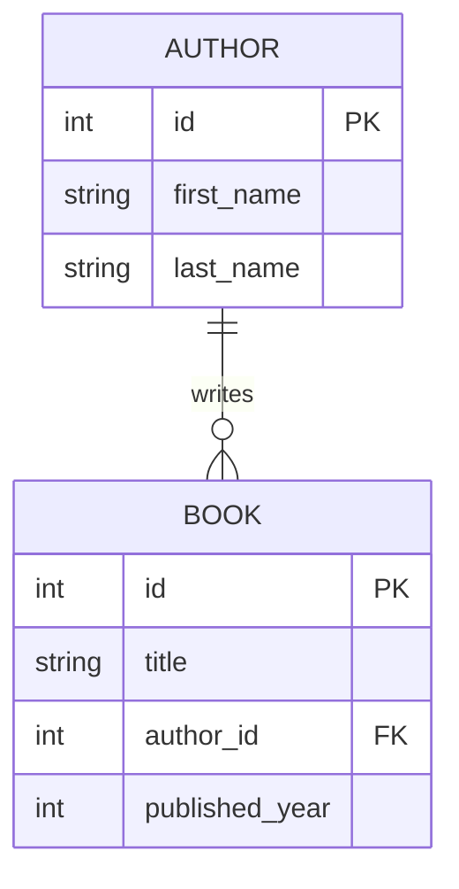
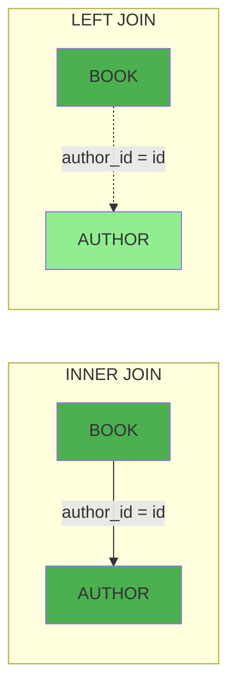

# Chapter 12: 다중 테이블 조인 (Joins)

안녕하세요! 12강에서는 실무에서 가장 빈번하게 사용되는 **JOIN** 연산을 jOOQ로 완벽히 표현하는 방법을 마스터합니다! 📚

---

## 1. JOIN이 필요한 상황

우리 DB에는 `book`과 `author` 테이블이 분리되어 있습니다.



책 목록을 조회할 때 "저자 이름"도 함께 가져오려면 JOIN이 필요합니다.

---

## 2. INNER JOIN - 일치하는 데이터만

```java
// Java: INNER JOIN
public List<BookWithAuthor> findBooksWithAuthor() {
    return dsl.select(
                BOOK.ID, BOOK.TITLE, BOOK.PUBLISHED_YEAR,
                AUTHOR.FIRST_NAME, AUTHOR.LAST_NAME
            )
            .from(BOOK)
            .join(AUTHOR).on(BOOK.AUTHOR_ID.eq(AUTHOR.ID))  // INNER JOIN
            .orderBy(BOOK.TITLE.asc())
            .fetchInto(BookWithAuthor.class);
}
```

```kotlin
// Kotlin: INNER JOIN
fun findBooksWithAuthor(): List<BookWithAuthor> =
    dsl.select(
            BOOK.ID, BOOK.TITLE, BOOK.PUBLISHED_YEAR,
            AUTHOR.FIRST_NAME, AUTHOR.LAST_NAME
        )
        .from(BOOK)
        .join(AUTHOR).on(BOOK.AUTHOR_ID.eq(AUTHOR.ID))
        .orderBy(BOOK.TITLE.asc())
        .fetchInto(BookWithAuthor::class.java)
```

> **핵심:** `author_id`가 NULL인 책은 결과에서 제외됩니다.

---

## 3. LEFT JOIN - 저자 없는 책도 포함

```java
// Java: LEFT JOIN
public List<BookWithAuthor> findAllBooksWithAuthor() {
    return dsl.select(
                BOOK.ID, BOOK.TITLE, BOOK.PUBLISHED_YEAR,
                AUTHOR.FIRST_NAME, AUTHOR.LAST_NAME
            )
            .from(BOOK)
            .leftJoin(AUTHOR).on(BOOK.AUTHOR_ID.eq(AUTHOR.ID)) // LEFT JOIN
            .orderBy(BOOK.TITLE.asc())
            .fetchInto(BookWithAuthor.class);
}
```

> **핵심:** `author_id`가 NULL인 책도 포함, `firstName/lastName`은 `null`이 됩니다.

---

## 4. JOIN + WHERE 필터링

```java
// Java: INNER JOIN + WHERE
public List<BookWithAuthor> findBooksAfterYearWithAuthor(int year) {
    return dsl.select(
                BOOK.ID, BOOK.TITLE, BOOK.PUBLISHED_YEAR,
                AUTHOR.FIRST_NAME, AUTHOR.LAST_NAME
            )
            .from(BOOK)
            .join(AUTHOR).on(BOOK.AUTHOR_ID.eq(AUTHOR.ID))
            .where(BOOK.PUBLISHED_YEAR.ge(year))       // 추가 WHERE 조건
            .orderBy(BOOK.PUBLISHED_YEAR.asc())
            .fetchInto(BookWithAuthor.class);
}
```

---

## 5. 결과 DTO

```java
// Java record로 깔끔하게 선언
public record BookWithAuthor(
    Integer id,
    String title,
    Integer publishedYear,
    String firstName,
    String lastName
) {}
```

```kotlin
// Kotlin data class
data class BookWithAuthor(
    val id: Int? = null,
    val title: String? = null,
    val publishedYear: Int? = null,
    val firstName: String? = null,
    val lastName: String? = null
)
```

---

## 6. JOIN 종류 비교



| JOIN 종류 | 메서드 | 저자 없는 책 포함? |
|---------|------|--------------|
| INNER JOIN | `.join(T).on(...)` | ❌ 제외 |
| LEFT JOIN | `.leftJoin(T).on(...)` | ✅ 포함 (null) |
| RIGHT JOIN | `.rightJoin(T).on(...)` | 오른쪽 기준 |

---

## 7. 요약

오늘 우리는:
1. **INNER JOIN**으로 양쪽에 일치하는 데이터만 조회했습니다.
2. **LEFT JOIN**으로 왼쪽 테이블 기준 전체 조회를 이해했습니다.
3. **WHERE 조건**을 JOIN 결과에 추가로 적용했습니다.
4. **DTO 매핑**으로 여러 테이블의 컬럼을 하나의 객체로 담았습니다.

다음 13강에서는 **서브쿼리와 CTE(Common Table Expressions)**를 다룹니다!
