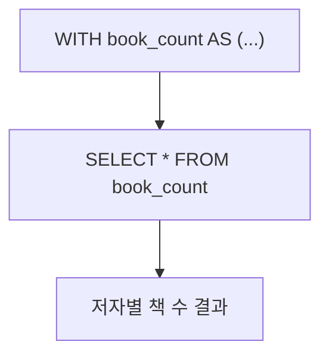

# Chapter 13: 서브쿼리와 CTE (Common Table Expressions)

13강에서는 **복잡한 쿼리를 가독성 있게 분해**하는 두 가지 핵심 기법을 마스터합니다! 🧩

---

## 1. Scalar Subquery - 단일 값 서브쿼리

평균 출판연도보다 최신인 책을 찾아야 할 때, 서브쿼리를 바로 WHERE 절에 사용합니다.

```java
// Java: Scalar Subquery
public List<Book> findBooksAboveAvgYear() {
    var avgYearSubquery = DSL.select(DSL.avg(BOOK.PUBLISHED_YEAR)).from(BOOK);

    return dsl.selectFrom(BOOK)
              .where(BOOK.PUBLISHED_YEAR.gt(
                  DSL.coerce(avgYearSubquery.asField(), Integer.class)
              ))
              .orderBy(BOOK.PUBLISHED_YEAR.desc())
              .fetchInto(Book.class);
}
```

```kotlin
// Kotlin: Scalar Subquery
fun findBooksAboveAvgYear(): List<Book> {
    val avgYearSubquery = DSL.select(DSL.avg(BOOK.PUBLISHED_YEAR)).from(BOOK)

    return dsl.selectFrom(BOOK)
        .where(BOOK.PUBLISHED_YEAR.gt(
            DSL.coerce(avgYearSubquery.asField<BigDecimal>(), Int::class.java)
        ))
        .orderBy(BOOK.PUBLISHED_YEAR.desc())
        .fetchInto(Book::class.java)
}
```

**▶ 실제 실행 SQL:**
```sql
SELECT
  "public"."book"."id",
  "public"."book"."title",
  "public"."book"."author_id",
  "public"."book"."published_year"
FROM "public"."book"
WHERE "public"."book"."published_year" > (
  SELECT avg("public"."book"."published_year")
  FROM "public"."book"
)
ORDER BY "public"."book"."published_year" DESC
```

> **핵심:** 서브쿼리가 WHERE 조건 안에 인라인으로 삽입됩니다. 매 쿼리 실행 시 서브쿼리가 먼저 평가되어 단일 값(평균)을 반환합니다.

---

## 2. CTE (`with()`) - 가독성 높은 임시 결과셋



```java
// Java: CTE with()
public List<AuthorBookCount> findAuthorsWithBookCount() {
    var bookCountCte = DSL.name("book_count").fields("author_id", "cnt")
            .as(DSL.select(BOOK.AUTHOR_ID, DSL.count().as("cnt"))
                   .from(BOOK)
                   .groupBy(BOOK.AUTHOR_ID));

    return dsl.with(bookCountCte)
              .select(
                  AUTHOR.ID, AUTHOR.FIRST_NAME, AUTHOR.LAST_NAME,
                  bookCountCte.field("cnt")
              )
              .from(bookCountCte)
              .join(AUTHOR).on(AUTHOR.ID.eq(bookCountCte.field("author_id", Integer.class)))
              .orderBy(DSL.field("cnt").desc())
              .fetchInto(AuthorBookCount.class);
}
```

**▶ 실제 실행 SQL:**
```sql
WITH "book_count"("author_id", "cnt") AS (
  SELECT
    "public"."book"."author_id",
    count(*) AS "cnt"
  FROM "public"."book"
  GROUP BY "public"."book"."author_id"
)
SELECT
  "public"."author"."id",
  "public"."author"."first_name",
  "public"."author"."last_name",
  "book_count"."cnt"
FROM "book_count"
JOIN "public"."author"
  ON "public"."author"."id" = "book_count"."author_id"
ORDER BY "cnt" DESC
```

> **핵심:** `WITH ... AS (...)` 절이 맨 앞에 정의되고, 메인 쿼리에서 `"book_count"`를 마치 테이블처럼 참조합니다.

---

## 3. CTE + JOIN - 최신 책 조회

```java
// Java: CTE + JOIN
public List<RecentBook> findRecentBooksPerAuthor() {
    var maxYearCte = DSL.name("max_year").fields("author_id", "max_y")
            .as(DSL.select(BOOK.AUTHOR_ID, DSL.max(BOOK.PUBLISHED_YEAR).as("max_y"))
                   .from(BOOK)
                   .groupBy(BOOK.AUTHOR_ID));

    return dsl.with(maxYearCte)
              .select(
                  BOOK.ID, BOOK.TITLE, BOOK.AUTHOR_ID, BOOK.PUBLISHED_YEAR,
                  AUTHOR.FIRST_NAME, AUTHOR.LAST_NAME
              )
              .from(BOOK)
              .join(AUTHOR).on(BOOK.AUTHOR_ID.eq(AUTHOR.ID))
              .join(maxYearCte)
                  .on(BOOK.AUTHOR_ID.eq(maxYearCte.field("author_id", Integer.class))
                      .and(BOOK.PUBLISHED_YEAR.eq(maxYearCte.field("max_y", Integer.class))))
              .orderBy(AUTHOR.LAST_NAME.asc())
              .fetchInto(RecentBook.class);
}
```

**▶ 실제 실행 SQL:**
```sql
WITH "max_year"("author_id", "max_y") AS (
  SELECT
    "public"."book"."author_id",
    max("public"."book"."published_year") AS "max_y"
  FROM "public"."book"
  GROUP BY "public"."book"."author_id"
)
SELECT
  "public"."book"."id",
  "public"."book"."title",
  "public"."book"."author_id",
  "public"."book"."published_year",
  "public"."author"."first_name",
  "public"."author"."last_name"
FROM "public"."book"
JOIN "public"."author"
  ON "public"."book"."author_id" = "public"."author"."id"
JOIN "max_year"
  ON "public"."book"."author_id" = "max_year"."author_id"
  AND "public"."book"."published_year" = "max_year"."max_y"
ORDER BY "public"."author"."last_name" ASC
```

> **핵심:** CTE `max_year`에서 저자별 최신 연도를 미리 계산한 뒤, 메인 쿼리에서 `JOIN "max_year"` 로 결합합니다. 조건이 author_id와 published_year 두 개 모두 일치할 때만 결과에 포함됩니다.

---

## 4. 세 가지 기법 비교

| 기법 | 용도 | jOOQ 메서드 | SQL 패턴 |
|------|------|------------|---------|
| **Scalar Subquery** | WHERE 절에 단일 값 서브쿼리 | `.asField("alias")` | `WHERE col > (SELECT ...)` |
| **CTE (with)** | 복잡 쿼리를 이름 붙여 분리 | `dsl.with(cte).select(...)` | `WITH name AS (...) SELECT ...` |
| **CTE + JOIN** | CTE 결과를 메인 쿼리와 결합 | `.join(cte).on(...)` | `WITH ... JOIN cte ON ...` |

---

## 5. 요약

오늘 우리는:
1. **Scalar Subquery**로 집계 결과를 동적 WHERE 조건에 활용했습니다.
2. **`with()` CTE**로 복잡한 집계 쿼리를 읽기 쉽게 분리했습니다.
3. **CTE + JOIN**으로 CTE 결과와 메인 테이블을 결합해 최신 책을 조회했습니다.

다음 14강에서는 **윈도우 함수 및 분석용 SQL**을 다룹니다!
