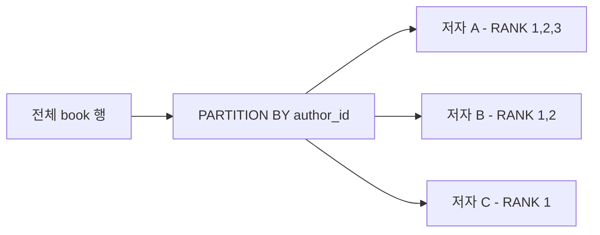

# Chapter 14: 윈도우 함수 및 분석용 SQL

14강에서는 **데이터를 실시간으로 분석**하는 SQL의 핵심 기능, 윈도우 함수를 jOOQ로 완벽히 표현합니다! 📊

---

## 1. 윈도우 함수란?

일반 집계 함수(`GROUP BY`)와 달리, 윈도우 함수는 **행을 유지하면서** 집계/순위를 계산합니다.



---

## 2. RANK() - 저자별 순위

```java
// Java: RANK() OVER (PARTITION BY author_id ORDER BY published_year DESC)
public List<BookRank> rankBooksByYearPerAuthor() {
    var rank = DSL.rank()
                  .over(DSL.partitionBy(BOOK.AUTHOR_ID)
                            .orderBy(BOOK.PUBLISHED_YEAR.desc()))
                  .as("rank_in_author");

    return dsl.select(
                  BOOK.ID, BOOK.TITLE, BOOK.AUTHOR_ID, BOOK.PUBLISHED_YEAR,
                  rank
              )
              .from(BOOK)
              .orderBy(BOOK.AUTHOR_ID.asc(), DSL.field("rank_in_author").asc())
              .fetchInto(BookRank.class);
}
```

```kotlin
// Kotlin: 동일 패턴
fun rankBooksByYearPerAuthor(): List<BookRank> {
    val rank = DSL.rank()
        .over(DSL.partitionBy(BOOK.AUTHOR_ID)
                  .orderBy(BOOK.PUBLISHED_YEAR.desc()))
        .`as`("rank_in_author")

    return dsl.select(
            BOOK.ID, BOOK.TITLE, BOOK.AUTHOR_ID, BOOK.PUBLISHED_YEAR, rank
        )
        .from(BOOK)
        .orderBy(BOOK.AUTHOR_ID.asc(), DSL.field("rank_in_author").asc())
        .fetchInto(BookRank::class.java)
}
```

---

## 3. SUM() OVER - 연도별 누적 출판 수

```java
// Java: 연도별 책 수 + 누적합
public List<YearlyRunningTotal> runningTotalByYear() {
    var bookCount = DSL.count().as("book_count");
    var runningTotal = DSL.sum(DSL.count())
                          .over(DSL.orderBy(BOOK.PUBLISHED_YEAR.asc()))
                          .as("running_total");

    return dsl.select(BOOK.PUBLISHED_YEAR, bookCount, runningTotal)
              .from(BOOK)
              .groupBy(BOOK.PUBLISHED_YEAR)
              .orderBy(BOOK.PUBLISHED_YEAR.asc())
              .fetchInto(YearlyRunningTotal.class);
}
```

---

## 4. RANK() + CTE - 저자별 1위 책만

```java
// CTE로 RANK 결과를 감싸서 rank=1만 필터
public List<BookRank> findTopRankedBookPerAuthor() {
    var rank = DSL.rank()
                  .over(DSL.partitionBy(BOOK.AUTHOR_ID)
                            .orderBy(BOOK.PUBLISHED_YEAR.desc()))
                  .as("rank_in_author");

    var rankedCte = DSL.name("ranked")
            .fields("id","title","author_id","published_year","rank_in_author")
            .as(DSL.select(BOOK.ID, BOOK.TITLE, BOOK.AUTHOR_ID, BOOK.PUBLISHED_YEAR, rank)
                   .from(BOOK));

    return dsl.with(rankedCte)
              .selectFrom(rankedCte)
              .where(rankedCte.field("rank_in_author", Integer.class).eq(1))
              .orderBy(rankedCte.field("author_id"))
              .fetchInto(BookRank.class);
}
```

---

## 5. 윈도우 함수 비교표

| 함수 | 용도 | jOOQ 메서드 |
|------|------|------------|
| `RANK()` | 동점 시 순위 건너뜀 (1,1,3) | `DSL.rank().over(...)` |
| `DENSE_RANK()` | 동점 시 순위 연속 (1,1,2) | `DSL.denseRank().over(...)` |
| `ROW_NUMBER()` | 순서 기준 고유 번호 | `DSL.rowNumber().over(...)` |
| `SUM/AVG/MAX` | 누적 집계 | `DSL.sum(f).over().orderBy(...)` |
| `LAG/LEAD` | 이전/다음 행 참조 | `DSL.lag(f).over(...)` |
