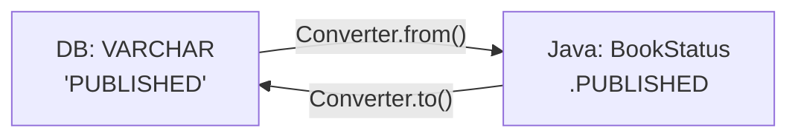

# Chapter 15: 커스텀 데이터 타입과 컨버터

15강에서는 **Java/Kotlin의 풍부한 타입 시스템**을 jOOQ를 통해 DB와 매끄럽게 연결합니다! 🔗

---

## 1. 왜 커스텀 컨버터가 필요한가?



DB는 `VARCHAR`나 `INT`만 저장하지만, Java/Kotlin 코드에서는 `Enum`, `LocalDate`, `Money` 같은 풍부한 타입을 사용하고 싶습니다. `Converter`가 이 두 세계를 연결합니다.

---

## 2. BookStatus Enum 및 Converter 정의

```java
// Java: Enum 정의
public enum BookStatus {
    DRAFT, PUBLISHED, ARCHIVED
}
```

```java
// Java: Converter 구현
public class BookStatusConverter implements Converter<String, BookStatus> {
    @Override
    public BookStatus from(String dbValue) {
        return dbValue == null ? null : BookStatus.valueOf(dbValue);
    }

    @Override
    public String to(BookStatus userValue) {
        return userValue == null ? null : userValue.name();
    }

    @Override
    public Class<String> fromType() { return String.class; }

    @Override
    public Class<BookStatus> toType() { return BookStatus.class; }
}
```

**▶ 실제 동작 SQL (Enum → VARCHAR 저장):**
```sql
UPDATE "public"."book"
SET "status" = 'PUBLISHED'
WHERE "public"."book"."id" = 1
```

```kotlin
// Kotlin: Enum 정의
enum class BookStatus { DRAFT, PUBLISHED, ARCHIVED }

// Kotlin: Converter - Converter.of() 팩토리 사용
val bookStatusConverter: Converter<String, BookStatus> = Converter.of(
    String::class.java,
    BookStatus::class.java,
    { dbVal -> dbVal?.let { BookStatus.valueOf(it) } },
    { enumVal -> enumVal?.name }
)
```

---

## 3. Enum 기반 필터 조회

```java
// Java: Enum 필터로 조회
public List<BookWithStatus> findByStatus(BookStatus status) {
    var converter = new BookStatusConverter();

    return dsl.select(BOOK.ID, BOOK.TITLE, BOOK.PUBLISHED_YEAR,
                       BOOK.STATUS.convertFrom(String.class, converter::from))
              .from(BOOK)
              .where(BOOK.STATUS.eq(converter.to(status)))
              .orderBy(BOOK.TITLE.asc())
              .fetchInto(BookWithStatus.class);
}
```

**▶ 실제 실행 SQL:**
```sql
SELECT
  "public"."book"."id",
  "public"."book"."title",
  "public"."book"."published_year",
  "public"."book"."status"
FROM "public"."book"
WHERE "public"."book"."status" = 'PUBLISHED'
ORDER BY "public"."book"."title" ASC
```

---

## 4. Enum 값 업데이트

```java
// Java: Enum 업데이트
public int updateBookStatus(int bookId, BookStatus newStatus) {
    var converter = new BookStatusConverter();

    return dsl.update(BOOK)
              .set(BOOK.STATUS, converter.to(newStatus))
              .where(BOOK.ID.eq(bookId))
              .execute();
}
```

**▶ 실제 실행 SQL:**
```sql
UPDATE "public"."book"
SET "status" = 'ARCHIVED'
WHERE "public"."book"."id" = 501
```

---

## 5. Converter 패턴 비교

| 방식 | 장점 | 단점 |
|------|------|------|
| **수동 변환** | 간단 | 매번 `valueOf()`/`name()` 호출 |
| **Converter 인터페이스** | 재사용 가능, 타입 안전 | 약간의 보일러플레이트 |
| **코드 생성 시 Converter 등록** | 완전 자동화 | 코드 생성 설정 필요 |
