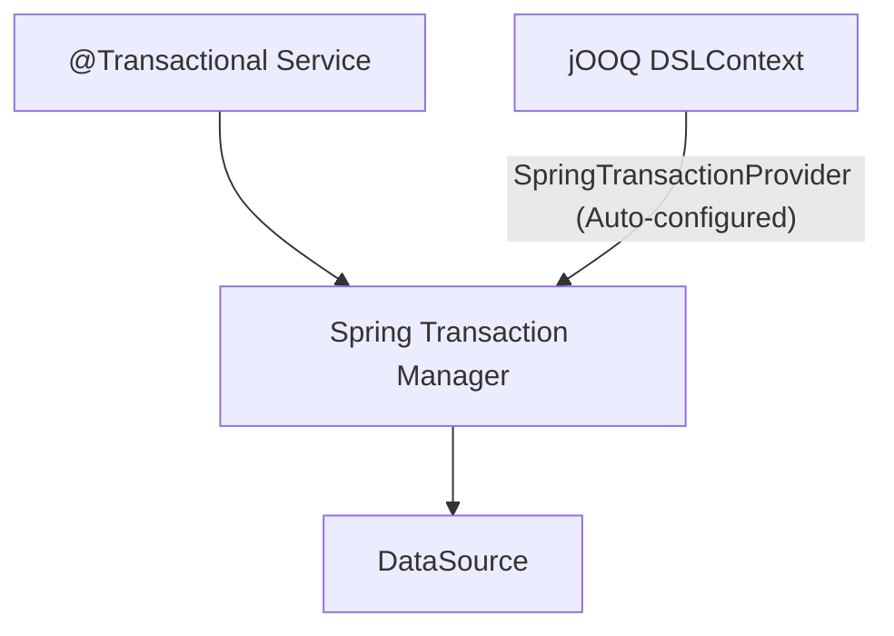

# Chapter 16: 트랜잭션과 스프링 통합

16강에서는 **스프링 부트 환경에서 jOOQ가 트랜잭션을 어떻게 다루는지** 학습합니다. 결론부터 말하자면, "스프링의 `@Transactional`을 그대로 쓰면 됩니다!" 🤝

---

## 1. jOOQ와 Spring 트랜잭션 추상화



Spring Boot의 `spring-boot-starter-jooq`를 사용하면, jOOQ의 `Configuration`에 커스텀 `TransactionProvider`가 자동 주입됩니다.
이로 인해 jOOQ가 실행하는 모든 쿼리는 스프링이 열어둔 `Connection` 파이프라인(ThreadLocal)에 자연스럽게 합류합니다.

---

## 2. 계층 분리: Repository와 Service

트랜잭션은 **비즈니스 흐름 단위**이므로 보통 Service 계층에 걸어둡니다.

### 2.1 Repository (순수 DB I/O)

```java
// Java: TransactionRepository.java
@Repository
@RequiredArgsConstructor
public class TransactionRepository {
    private final DSLContext dsl;

    public void saveAuthor(int id, String firstName, String lastName) {
        dsl.insertInto(AUTHOR)
           .set(AUTHOR.ID, id)
           .set(AUTHOR.FIRST_NAME, firstName)
           .set(AUTHOR.LAST_NAME, lastName)
           .execute();
    }
}
```

```sql
-- 실행 SQL
INSERT INTO "public"."author" ("id", "first_name", "last_name") VALUES (?, ?, ?)
```

### 2.2 Service (트랜잭션 경계 설정)

```java
// Java: TransactionService.java
@Service
@RequiredArgsConstructor
public class TransactionService {
    private final TransactionRepository repository;

    @Transactional
    public void saveAuthorAndBookSuccessfully(int authorId) {
        repository.saveAuthor(authorId, "Tx", "Success");
        // ... 성공적으로 커밋됨
    }

    @Transactional
    public void saveAuthorAndThrowException(int authorId) {
        repository.saveAuthor(authorId, "Tx", "Fail");
        // 강제로 RuntimeException 발생! -> 롤백되어야 함
        throw new RuntimeException("Intentional Exception for Rollback");
    }
}
```

---

## 3. 요약

1. **자동화된 연동:** Spring Boot 환경에서는 아무 설정 없이 `@Transactional` 이 jOOQ에 적용됩니다.
2. **트랜잭션 롤백 테스트:** 서비스 메서드 안에서 쿼리를 실행했어도 결과적으로 `RuntimeException`이 던져지면, 모든 DB 작업은 롤백되어 원상 복구됩니다.
3. JPA와 jOOQ를 함께 사용할 때도 동일한 `TransactionManager`를 공유하므로, 한 트랜잭션 안에서 JPA 삽입과 jOOQ 조회가 매끄럽게 엮입니다.

다음 17강에서는 **배치(Batch) 처리와 성능 최적화** 기법을 다룹니다!
