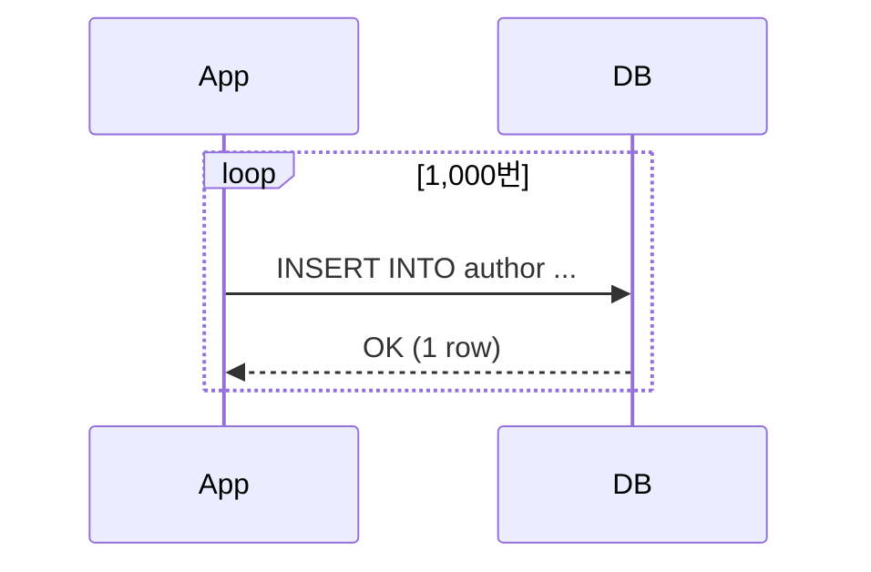
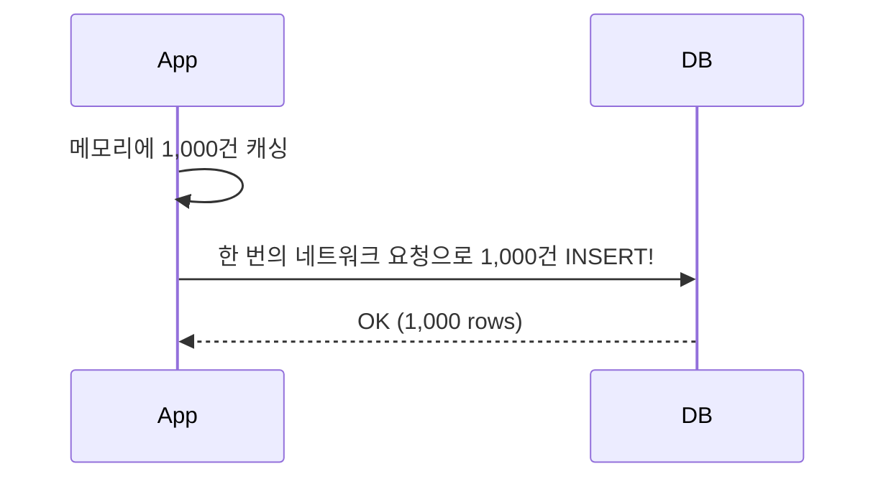

# Chapter 17: 배치(Batch) 처리와 성능

17강에서는 대량의 데이터를 DB에 적재할 때 발생하는 **네트워크/I/O 병목**을 jOOQ의 Batch 기능으로 해결하는 법을 배웁니다. 🚀

---

## 1. 단건 Insert의 한계

1,000명의 저자를 DB에 등록해야 할 때, 다음과 같이 루프를 돌면 어떻게 될까요?

```java
// Anti-Pattern: Network I/O가 1,000번 발생
for (Author a : authors) {
    dsl.insertInto(AUTHOR)
       .set(AUTHOR.ID, a.getId())
       .set(AUTHOR.FIRST_NAME, a.getFirstName())
       .execute();
}
```



이 방식은 **DB와 애플리케이션 사이를 1,000번 왕복**하므로 치명적인 성능 저하를 일으킵니다.

---

## 2. jOOQ의 `batchInsert()`

jOOQ는 손쉽게 JDBC의 `addBatch()`, `executeBatch()`를 활용하도록 `batchInsert()`를 제공합니다.

```java
// Best-Practice: 메모리에 모아서 한 번에!
public void insertInBatch(List<Author> authors) {
    // 1. DTO를 jOOQ Record 형태로 변환
    var records = authors.stream()
            .map(a -> {
                var record = dsl.newRecord(AUTHOR);
                record.setId(a.getId());
                record.setFirstName(a.getFirstName());
                record.setLastName(a.getLastName());
                return record;
            })
            .toList();

    // 2. batchInsert 호출
    dsl.batchInsert(records).execute();
}
```



**▶ 실제 효과:**
테스트 코드 실행 시 단건 Insert는 약 `400~500ms`, 배치 Insert는 `20~40ms`로 보통 **10배 이상** 성능 차이가 벌어집니다.

---

## 3. 필수 설정: JDBC Driver Options

jOOQ에서 코드를 멋지게 작성해도, JDBC Driver 단에서 최적화가 꺼져 있으면 말짱 도루묵입니다.
PostgreSQL/MySQL에서는 **반드시 URL 파라미터로 최적화 옵션을 활성화**해야 합니다.

### PostgreSQL (application.yml)
```yaml
spring:
  datasource:
    # reWriteBatchedInserts=true 가 핵심!
    url: jdbc:postgresql://localhost:5432/jooq_demo?reWriteBatchedInserts=true
```
- `reWriteBatchedInserts=true`를 주면 JDBC가 내부적으로 수백 개의 `INSERT` 문을 `INSERT INTO table VALUES (...), (...), (...)` 형태의 단일 Multi-value INSERT로 재작성(Rewrite)하여 전송합니다.

> MySQL의 경우 `rewriteBatchedStatements=true` 파라미터를 사용합니다.

---

결론적으로, 다건의 DML(Insert/Update/Delete)이 예상되는 구간에서는 무조건 `batch()` 계열 API를 써서 Network Round-trip을 최소화해야 합니다.

다음 18강에서는 **JPA와 jOOQ를 섞어 쓰는 Repository 패턴 아키텍처**에 대해 심도 있게 분석합니다!
